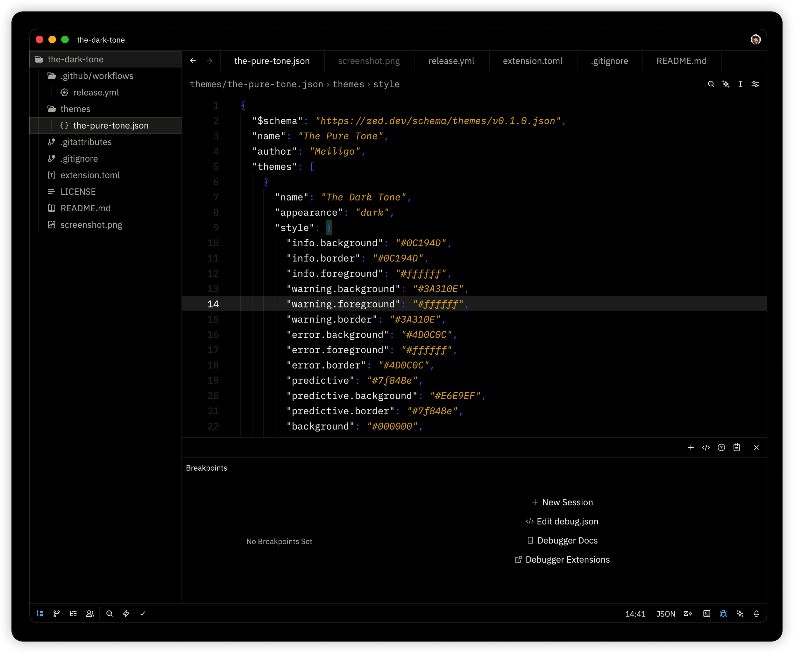

# The Pure Tone

Pure and elegant color themes for [Zed Editor](https://zed.dev/).



## Themes

- **The Dark Tone** - 深色主题
- **The Dark Soft Tone** - 柔和深色主题
- **The Black Tone** - 纯黑主题
- **The Light Tone** - 浅色主题
- **The Light Soft Tone** - 柔和浅色主题

## Installation

### From Zed Extensions

1. Open Zed Editor
2. Press `Cmd/Ctrl + Shift + P` to open command palette
3. Type "zed: extensions" and select it
4. Search for "The Pure Tone"
5. Click Install

### Manual Installation

1. Clone this repository
2. Run `bun run build` to generate the theme file
3. Copy `themes/the-pure-tone.json` to your Zed themes directory:
   - **macOS/Linux**: `~/.config/zed/themes/`
   - **Windows**: `%APPDATA%/Zed/themes/`
4. Restart Zed or reload themes

## Development

### Prerequisites

- [Bun](https://bun.sh/) >= 1.0

### Setup

```bash
# Install dependencies
bun install

# Build theme
bun run build

# Validate theme
bun run validate:schema

# Run tests
bun test
```

### Preview & Screenshots

```bash
# Generate HTML previews
bun run previews

# Open previews/index.html in your browser to see all themes
```

See [SCREENSHOTS.md](./SCREENSHOTS.md) for detailed instructions on generating theme previews and screenshots.

### Project Structure

```
.
├── src/
│   ├── colors.ts          # Color definitions
│   ├── theme.ts           # Theme generator
│   ├── types.ts           # TypeScript types (auto-generated from schema)
│   ├── check.ts           # Basic validation
│   ├── validate-schema.ts # Schema-based validation
│   └── screenshot.ts      # Preview HTML generator
├── themes/
│   └── the-pure-tone.json # Generated theme file
└── previews/              # Generated HTML previews
```

## Contributing

Contributions are welcome! Please feel free to submit a Pull Request.

## License

[MIT License](./LICENSE)
